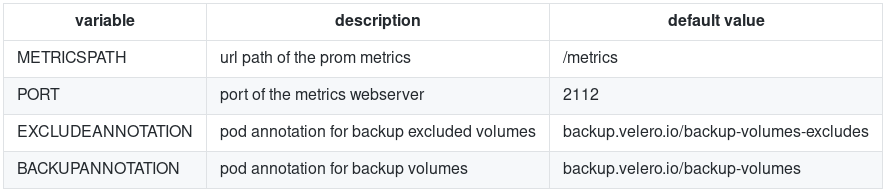
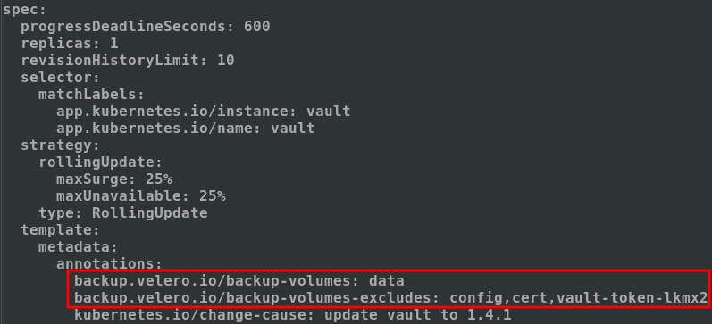
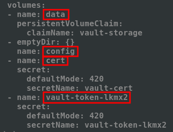

[Main menu](../README.md)

# Add-ons
## velero-pvc-watcher

**velero-pvc-watcher** is a Kubernetes controller for velero that detects PVCs with no restic backup and exposes a prometheus metric

If you use restic with velero you must annotate all pods to enable volume backups.

This controller will expose prometheus metrics with a static value '1' to generate alerts for volumes that are not in the backup or backup-exclusion annotation.

- https://github.com/bitsbeats/velero-pvc-watcher

Here are ENV variables from this add-on:

<p align="center">
  
</p>

### Installation

Add helm repo, download and install velero-pvc-watcher:

```
helm repo add bitsbeats https://bitsbeats.github.io/helm-charts
helm fetch --untar bitsbeats/velero-pvc-watcher
helm install --name velero-pvc-watcher velero-pvc-watcher/ --namespace velero
```

```console
[root@workstation ~ ]$ helm install --name velero-pvc-watcher velero-pvc-watcher/ --namespace velero --tls
NAME:   velero-pvc-watcher
LAST DEPLOYED: Mon Jul 13 12:40:38 2020
NAMESPACE: velero
STATUS: DEPLOYED

RESOURCES:
==> v1/ServiceAccount
NAME                SECRETS  AGE
velero-pvc-watcher  2        0s

==> v1/ClusterRole
NAME                AGE
velero-pvc-watcher  0s

==> v1/ClusterRoleBinding
NAME                AGE
velero-pvc-watcher  0s

==> v1/Service
NAME                TYPE       CLUSTER-IP      EXTERNAL-IP  PORT(S)   AGE
velero-pvc-watcher  ClusterIP  172.30.243.242  <none>       2112/TCP  0s

==> v1/Deployment
NAME                DESIRED  CURRENT  UP-TO-DATE  AVAILABLE  AGE
velero-pvc-watcher  1        1        1           0          0s

==> v1/Pod(related)
NAME                                 READY  STATUS             RESTARTS  AGE
velero-pvc-watcher-5cbf997894-q9gm2  0/1    ContainerCreating  0         3s
```

### Configure

Annotations should be placed on `deployment` resources in order to make `ReplicaSet/StatefulSet` annotated as well. You need to tag either **included** or **excluded** volumes or both if you want pvc-watcher to be count it as checked. 

Following annotations need to be added to the `deployment` resource under `deployment.spec.template.metadata.annotations` section:

```yaml
    backup.velero.io/backup-volumes: data
    backup.velero.io/backup-volumes-excludes: config,cert
```

Here is an example for `vault deployment` :

<p align="center">
  
</p>

Volume name to fill are the names you can find under the ```pod.spec.volume``` section, DO NOT use PVC name.

<p align="center">
  
</p>

Once done, `ReplicaSet/StatefulSet` and `Pods` should be properly annotated and velero-pvc-watcher will notice volume annotation.


---------------------------------------------------------------------------------------------------------------------------------

[Main menu](../README.md)

[Next](06-prometheus-grafana.md)