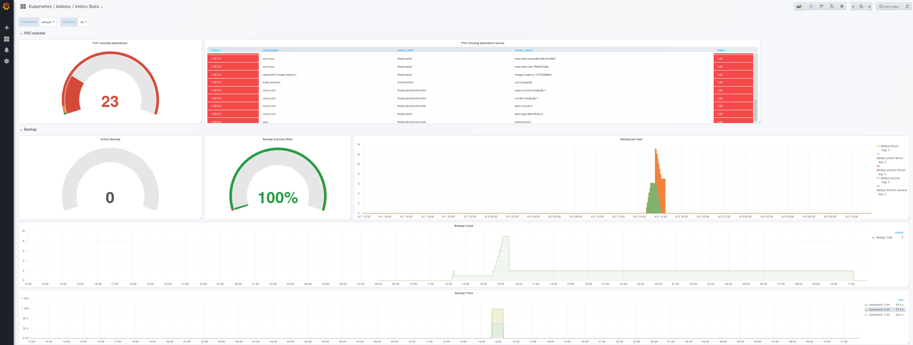

[Main menu](../README.md)

# Prometheus 
## OpenShift

OpenShift provides an embedded prometheus server. However, version < 4.3 de not provide the availability to monitor custom services. You can follow the links for official OpenShift documentation:

- https://docs.openshift.com/container-platform/4.3/monitoring/cluster_monitoring/configuring-the-monitoring-stack.html
- https://docs.openshift.com/container-platform/4.3/monitoring/monitoring-your-own-services.html

## MCM 

With IBM Cloud Pak MCM, prometheus+grafana is embeded. You can access the Grafana server through the MCM WEB UI.

## Configuration

First thing you want to set is Prometheus retention of information. First check retention time with following command : 

```console
[root@workstation ~ ]$ oc get prometheus monitoring-prometheus -n kube-system -o yaml | grep retention
  retention: 24h
```

By default it's 24h but you can extend to 7 days for example (168h) by editing this file.

# Grafana

Grafana provides a custom dashboard for velero (ID 11055):

https://grafana.com/grafana/dashboards/11055

You can directly load this dashboard to start monitoring velero.

I provided an enhanced Grafana dashboard with additional informations about `velero-pvc-watcher` addon here [Grafana enhanced dashboard JSON](../resources/velero/grafana/Kubernetes _ Addons _ Velero Stats-1591178070559.json)
This dashboard displays the number of missing PVC annotations and also which namespace ans which resources.

<p align="center">
  
</p>

---------------------------------------------------------------------------------------------------------------------------------

[Main menu](../README.md)

[Next](07-alert-manager.md)